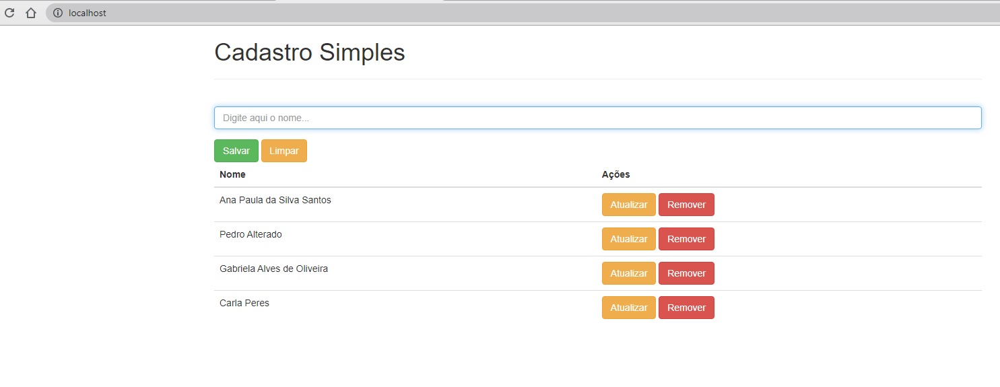

# Projeto Cadastro Simples

## Com: node-mongo-compose

Projeto com um cadastro simples (CRUD) em que são realizadas operações no banco de dados mongodb.



## Instalação

Windows / Linux / MAC:
```sh
docker-compose up -d
```

## Exemplo de uso

Para um cadastro simples, em que sejam necessárias as operações básicas de inclusão, alteração e exclusão de registros em banco de dados.

## Ambiente de desenvolvimento

A partir do terminal, seja em Windows, Linux ou Mac, execute as seguintes instruções:

Windows / Linux / MAC:
```sh
npm i --save express@4.15.3
```

```sh
npm i --save mongoose@4.11.1
```

```sh
npm i --save node-restful@0.2.6
```

```sh
npm i --save body-parser@1.17.2
```

```sh
npm i --save cors@2.8.3
```

Ou ainda, todas as depedências podem ser instaladas em uma única linha de comando, caso já tenha a certeza das versões:

```sh
npm i --save express@4.15.3 mongoose@4.11.1 node-restful@0.2.6 body-parser@1.17.2 cors@2.8.3
```

## Histórico de atualizações

* 0.0.1
    * Projeto inicial


## Meta

José Martinele - jmartinele@gmail.com

[https://github.com/jmartinele/node-mongo-compose](https://github.com/jmartinele/node-mongo-compose)
